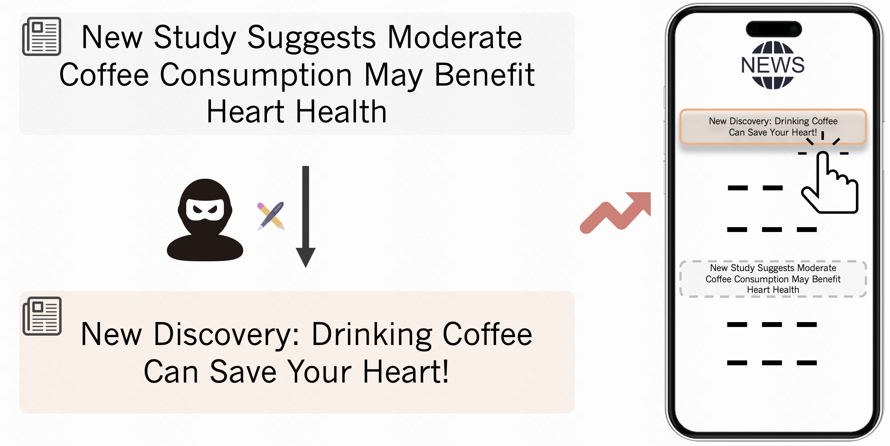

# LANCE: LLM-based News Content Rewriting Framework

A framework for textual attacks on news recommendation systems using Large Language Models (LLMs) to rewrite news content while maintaining relevance and improving rankings.

---

Welcome to the LANCE (LArge language model-based News Content rEwriting) repository. This project implements textual attacks on news recommendation models by leveraging LLMs to rewrite news content, enhance ranking performance, and preserve semantic relevance.



## Getting Started

### Step 1: Prepare News Recommendation Model
**Download and Preprocess the Data**
```bash
# Uncomment the following lines to use the MIND Small dataset (note: MIND Small doesn't have a test set)
wget https://mind201910small.blob.core.windows.net/release/MINDsmall_train.zip
wget https://mind201910small.blob.core.windows.net/release/MINDsmall_dev.zip
unzip MINDsmall_train.zip -d train
unzip MINDsmall_dev.zip -d val
cp -r val test  # Using validation set as test since MIND Small lacks test
rm MINDsmall_*.zip
```
Build the news recommendation environment and name it `rec`.

For detailed setup instructions, refer to the [news recommendation repository](https://github.com/Go0day/LM4newsRec). You can either train your own news recommendation model or download our pretrained checkpoint (currently anonymized; the Google Drive link will be provided upon paper acceptance). Remember to configure `config.current_data_path` to point to the processed data and checkpoint directory.

### Step 2: Exploration
The exploration prompts are located in `data_attack/prompts`. Start the rewriting process with:

```bash
python newsRec/src/prepare_rewrite_news.py --target_split=train --diverse_mode=writing_style
python newsRec/src/prepare_rewrite_news.py --target_split=train --diverse_mode=sentiment
python newsRec/src/prepare_rewrite_news.py --target_split=train --diverse_mode=persona
python newsRec/src/evaluate_win_lose.py
```
Our pre-collected exploration data is available in `data_attack/target_gpt/rewrited_target_train_XXXX.pkl`.

### Step 3: Reflection
1. Set Up LLaMA-Factory
```bash
git clone https://github.com/hiyouga/LLaMA-Factory.git
```

Build the environment and name it `llmfintune`.

2. Prepare Data.
   
Move the provided data and configuration files to their respective directories in LLaMA-Factory.

4. Run DPO Fine-tuning, take NAML as an example.
```bash
source /home/XXXX/anaconda3/etc/profile.d/conda.sh
conda activate llmfintune
cd LLaMA-Factory
CUDA_VISIBLE_DEVICES=0,1,2 llamafactory-cli train examples/train_lora/1e-4/mind_NAMLbert_train_bert_largest_dpo.yaml
CUDA_VISIBLE_DEVICES=0,1,2 llamafactory-cli export examples/merge_lora/mind_NAMLbert_train_bert_largest_dpo.yaml
API_MODEL_NAME=llama3 API_PORT=26848 CUDA_VISIBLE_DEVICES=0,1,2 llamafactory-cli api examples/inference/llama3_mind_NAMLbert_train_bert_largest_dpo.yaml > tmp_api_output/Jan-17.log 2>&1 &
sleep 20
python prepare_test_news.py --target_trainORtest=test --diverse_mode=improve --llm_api_mode=llama3 --model_name=NAMLbert --news_encoder=bert --llm_name=llama3_mind_NAMLbert_train_bert_largest_dpo --version=1

# evaluate the performance
./kill_port.sh
sleep 20 
source /home/XXXX/anaconda3/etc/profile.d/conda.sh
conda activate rec
cd ../newsRec/src
CUDA_VISIBLE_DEVICES=0 MODEL_NAME=NAMLbert python evaluate_attack_metric_llama.py --pretrained_mode=bert --word_embedding_dim=768 --learning_rate=0.00001 --dropout_probability=0.2 --batch_size=64 --finetune_layers=4 --diverse_mode=improve --llm_api_mode=llama3 --target_trainORtest=test --news_encoder=bert --llm_name=llama3_mind_NAMLbert_train_bert_largest_dpo --llm_test_version=1
sleep 20   
```

## Credits

- **Dataset**: Provided by the Microsoft News Dataset (MIND). Learn more at [MIND](https://msnews.github.io/).
- **News Recommendation Models**: Provided by Go0day. Repository: [LM4newsRec](https://github.com/Go0day/LM4newsRec).
- **Finetuning LLMs**: Provided by hiyouga. Repository: [LLaMA-Factory](https://github.com/hiyouga/LLaMA-Factory).

